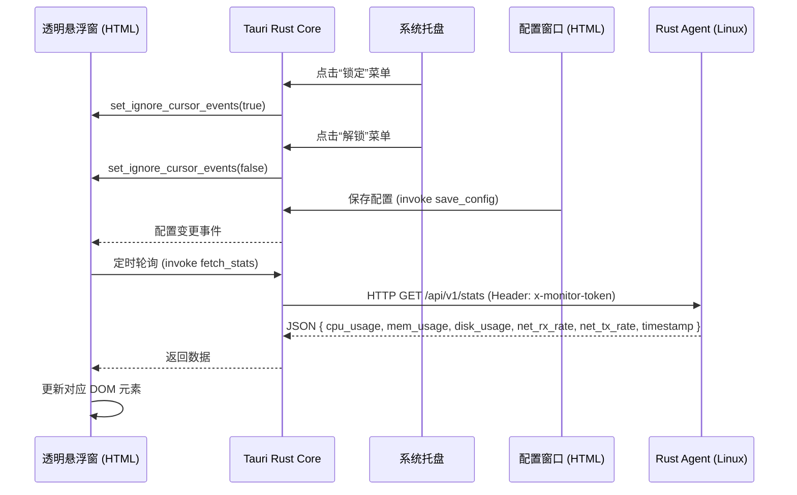

# 🚀 轻量系统监控悬浮窗 (Tauri + Rust Agent) 开发文档

## 一、项目概述
**目标**：开发一个极简、实时的系统资源监控透明悬浮窗，常驻桌面，通过托盘控制交互。
**架构**：Client-Server (Agent) 模式。
- **Server (Agent)**：Rust 后台服务，部署于 Linux，高频采集系统指标，通过 HTTP API 暴露数据。
- **Client (Tauri)**：Windows 10 上的透明悬浮窗 + 独立配置窗口。悬浮窗**仅作显示**，无任何编辑功能；所有指标顺序、显示隐藏等配置在独立配置窗口中完成。
**核心要求**：零 Shell 依赖、真正的实时性（异步无阻塞）、极低资源占用（CPU < 0.5%, 内存 < 10MB）、悬浮窗可穿透/可拖动由托盘控制。
**项目名称**：MonBall（意为Monitor Balloon，监控气泡）

---

## 二、技术栈选型（严格执行）

### 1. Server 端 (Linux)
- **语言**：Rust (Edition 2021)
- **Web 框架**：`axum = "0.7"` + `tower-http = { version = "0.5", features = ["cors"] }`（与 Rust 1.96 完全兼容）
- **异步运行时**：`tokio = { version = "1.35", features = ["full"] }`
- **系统信息采集**：`sysinfo = "0.30"`
- **序列化**：`serde = { version = "1.0", features = ["derive"] }` + `serde_json = "1.0"`
- **编译目标**：`x86_64-unknown-linux-musl`（静态链接，零依赖部署）

### 2. Client 端 (Windows 10 Tauri v2)
- **框架**：Tauri v2.x（仅使用其原生窗口能力，**不引入任何前端框架**）
- **悬浮窗**：纯 HTML + CSS + 原生 JavaScript（`index.html`，无需构建工具）
- **配置窗口**：独立 HTML 文件（`config.html`），通过托盘菜单打开
- **托盘**：使用 Tauri v2 `TrayIcon` 模块，菜单项包括「锁定」「解锁」「配置」「退出」
- **透明窗口**：`tauri.conf.json` 中设置 `"transparent": true`，配合 CSS 背景透明

---

## 三、系统架构与数据流



---

## 四、核心模块开发指南

### 模块 1：Server 端 (Rust Agent) – 修正版

#### 1.1 依赖配置 (`Cargo.toml`)
```toml
[package]
name = "sysmon-agent"
version = "0.1.0"
edition = "2021"

[dependencies]
axum = "0.7"
tokio = { version = "1.35", features = ["full"] }
sysinfo = "0.30"
serde = { version = "1.0", features = ["derive"] }
serde_json = "1.0"
tower-http = { version = "0.5", features = ["cors"] }
tracing = "0.1"
tracing-subscriber = "0.3"
```

#### 1.2 数据结构 (`src/types.rs`)
```rust
use serde::Serialize;

#[derive(Serialize, Clone, Debug)]
pub struct SystemStats {
    pub cpu_usage: f32,       // 百分比 (0.0 - 100.0)
    pub mem_usage: f32,       // 百分比 (0.0 - 100.0)
    pub disk_usage: f32,      // 百分比 (0.0 - 100.0)
    pub net_rx_rate: u64,     // 接收速率 (Bytes/sec)
    pub net_tx_rate: u64,     // 发送速率 (Bytes/sec)
    pub timestamp: u64,       // Unix 时间戳 (秒)
}
```

#### 1.3 后台采集器 (`src/collector.rs`) – 已修复差分逻辑与错误处理
```rust
use crate::types::SystemStats;
use std::sync::{Arc, Mutex};
use std::time::{Duration, SystemTime, UNIX_EPOCH};
use sysinfo::{System, Networks, Disks, CpuRefreshKind, RefreshKind};
use tokio::time::sleep;

pub struct StatsCollector {
    stats: Arc<Mutex<SystemStats>>,
    last_net_rx: Arc<Mutex<u64>>,
    last_net_tx: Arc<Mutex<u64>>,
    last_time: Arc<Mutex<Duration>>,
}

impl StatsCollector {
    pub fn new() -> Self {
        let initial_stats = SystemStats {
            cpu_usage: 0.0, mem_usage: 0.0, disk_usage: 0.0,
            net_rx_rate: 0, net_tx_rate: 0, timestamp: 0,
        };
        Self {
            stats: Arc::new(Mutex::new(initial_stats)),
            last_net_rx: Arc::new(Mutex::new(0)),
            last_net_tx: Arc::new(Mutex::new(0)),
            last_time: Arc::new(Mutex::new(Duration::ZERO)),
        }
    }

    pub fn get_stats(&self) -> SystemStats {
        // 在只读查询时仍可 unwrap，因为 Mutex 毒化在采集任务中不会发生
        self.stats.lock().unwrap().clone()
    }

    pub async fn start_background_task(self: Arc<Self>) {
        // 只刷新需要的组件，降低 CPU 占用
        let mut sys = System::new_with_specifics(
            RefreshKind::nothing()
                .with_cpu(CpuRefreshKind::everything())
                .with_memory()
        );
        let mut networks = Networks::new_with_refreshed_list();

        // 首次采样建立基线
        sleep(Duration::from_millis(500)).await;
        sys.refresh_cpu_all();
        sys.refresh_memory();
        networks.refresh();
        let mut total_rx = networks.iter().map(|(_, d)| d.received()).sum::<u64>();
        let mut total_tx = networks.iter().map(|(_, d)| d.transmitted()).sum::<u64>();
        *self.last_net_rx.lock().unwrap() = total_rx;
        *self.last_net_tx.lock().unwrap() = total_tx;
        *self.last_time.lock().unwrap() = SystemTime::now()
            .duration_since(UNIX_EPOCH)
            .unwrap_or(Duration::ZERO);

        loop {
            // 1. CPU & Memory
            sys.refresh_cpu_all();
            sys.refresh_memory();
            let cpu = sys.global_cpu_info().cpu_usage();
            let mem = if sys.total_memory() > 0 {
                (sys.used_memory() as f32 / sys.total_memory() as f32) * 100.0
            } else {
                0.0
            };

            // 2. Disk (仅根目录)
            let disks = Disks::new_with_refreshed_list();
            let disk = disks
                .iter()
                .find(|d| d.mount_point().to_str() == Some("/"))
                .map(|d| {
                    if d.total_space() > 0 {
                        ((d.total_space() - d.available_space()) as f32 / d.total_space() as f32) * 100.0
                    } else {
                        0.0
                    }
                })
                .unwrap_or(0.0);

            // 3. Network 速率（精确差分）
            networks.refresh();
            let current_rx = networks.iter().map(|(_, d)| d.received()).sum::<u64>();
            let current_tx = networks.iter().map(|(_, d)| d.transmitted()).sum::<u64>();
            let now = SystemTime::now()
                .duration_since(UNIX_EPOCH)
                .unwrap_or(Duration::ZERO);

            let (rx_rate, tx_rate) = {
                let last_rx = *self.last_net_rx.lock().unwrap();
                let last_tx = *self.last_net_tx.lock().unwrap();
                let last_time = *self.last_time.lock().unwrap();
                let elapsed = now.as_secs_f64() - last_time.as_secs_f64();
                if elapsed > 0.0 {
                    (
                        ((current_rx.saturating_sub(last_rx)) as f64 / elapsed) as u64,
                        ((current_tx.saturating_sub(last_tx)) as f64 / elapsed) as u64,
                    )
                } else {
                    (0, 0)
                }
            };

            // 更新历史值
            *self.last_net_rx.lock().unwrap() = current_rx;
            *self.last_net_tx.lock().unwrap() = current_tx;
            *self.last_time.lock().unwrap() = now;

            let timestamp = now.as_secs();

            // 更新共享状态（避免裸 unwrap，采用 if let 防御）
            if let Ok(mut guard) = self.stats.lock() {
                guard.cpu_usage = cpu;
                guard.mem_usage = mem;
                guard.disk_usage = disk;
                guard.net_rx_rate = rx_rate;
                guard.net_tx_rate = tx_rate;
                guard.timestamp = timestamp;
            }

            sleep(Duration::from_millis(1000)).await;
        }
    }
}
```

#### 1.4 API 路由与鉴权 (`src/main.rs`)
```rust
use axum::{routing::get, Router, http::StatusCode, response::IntoResponse, Json};
use tower_http::cors::CorsLayer;
use std::sync::Arc;
use tracing::info;

mod types;
mod collector;
use collector::StatsCollector;

async fn auth_middleware(
    headers: axum::http::HeaderMap,
) -> Result<(), (StatusCode, &'static str)> {
    let token = headers.get("x-monitor-token").and_then(|v| v.to_str().ok());
    let expected_token = std::env::var("MONITOR_TOKEN").unwrap_or_else(|_| "secret123".to_string());
    if token == Some(expected_token.as_str()) {
        Ok(())
    } else {
        Err((StatusCode::UNAUTHORIZED, "Invalid token"))
    }
}

#[tokio::main]
async fn main() {
    tracing_subscriber::fmt::init();

    let collector = Arc::new(StatsCollector::new());
    let collector_clone = collector.clone();
    tokio::spawn(async move { collector_clone.start_background_task().await });

    let app = Router::new()
        .route("/api/v1/stats", get(move || {
            let c = collector.clone();
            async move { Json(c.get_stats()) }
        }))
        .layer(axum::middleware::from_fn(auth_middleware))
        .layer(CorsLayer::permissive());

    let port = std::env::var("PORT").unwrap_or_else(|_| "8080".to_string());
    let addr = format!("0.0.0.0:{}", port);
    info!("Agent listening on {}", addr);
    let listener = tokio::net::TcpListener::bind(&addr).await.unwrap();
    axum::serve(listener, app).await.unwrap();
}
```

---

### 模块 2：Client 端 (Tauri v2 透明悬浮窗) – 纯 HTML 实现

#### 2.1 窗口与托盘配置 (`tauri.conf.json` 关键片段)
```json
{
  "app": {
    "withGlobalTauri": true,
    "windows": [
      {
        "label": "overlay",
        "title": "SysMon",
        "url": "index.html",
        "width": 240,
        "height": 160,
        "decorations": false,
        "alwaysOnTop": true,
        "skipTaskbar": true,
        "transparent": true,
        "resizable": false,
        "focus": false,
        "visible": true
      },
      {
        "label": "config",
        "title": "配置",
        "url": "config.html",
        "width": 320,
        "height": 480,
        "resizable": false,
        "visible": false
      }
    ],
    "tray": {
      "iconPath": "icons/icon.png",
      "menuOnLeftClick": false
    }
  }
}
```

#### 2.2 Rust 侧托盘、命令与配置管理 (`src-tauri/src/main.rs`)
```rust
#![cfg_attr(not(debug_assertions), windows_subsystem = "windows")]

use tauri::{
    menu::{MenuBuilder, MenuItemBuilder},
    tray::{MouseButton, TrayIconBuilder},
    Manager,
};
use std::fs;
use std::path::PathBuf;

// 数据请求命令
#[tauri::command]
fn fetch_stats(ip: String, port: u16, token: String) -> Result<serde_json::Value, String> {
    let url = format!("http://{}:{}/api/v1/stats", ip, port);
    let client = reqwest::blocking::Client::new();
    let resp = client
        .get(&url)
        .header("x-monitor-token", &token)
        .send()
        .map_err(|e| e.to_string())?;
    let json: serde_json::Value = resp.json().map_err(|e| e.to_string())?;
    Ok(json)
}

// 读取配置
#[tauri::command]
fn read_config(app: tauri::AppHandle) -> Result<serde_json::Value, String> {
    let path = get_config_path(&app)?;
    if path.exists() {
        let content = fs::read_to_string(&path).map_err(|e| e.to_string())?;
        serde_json::from_str(&content).map_err(|e| e.to_string())
    } else {
        // 默认配置
        Ok(serde_json::json!({
            "items": [
                {"id":"cpu","label":"CPU","show":true},
                {"id":"mem","label":"MEM","show":true},
                {"id":"disk","label":"DISK","show":true},
                {"id":"net","label":"NET","show":true}
            ],
            "server": {"ip":"127.0.0.1","port":8080,"token":"secret123"}
        }))
    }
}

// 保存配置
#[tauri::command]
fn save_config(app: tauri::AppHandle, config: serde_json::Value) -> Result<(), String> {
    let path = get_config_path(&app)?;
    let json = serde_json::to_string_pretty(&config).map_err(|e| e.to_string())?;
    fs::write(&path, json).map_err(|e| e.to_string())
}

// 辅助：获取配置路径
fn get_config_path(app: &tauri::AppHandle) -> Result<PathBuf, String> {
    use tauri::api::path::app_config_dir;
    let mut dir = app_config_dir(&app.config()).ok_or("Config dir not found")?;
    fs::create_dir_all(&dir).map_err(|e| e.to_string())?;
    dir.push("overlay_config.json");
    Ok(dir)
}

fn main() {
    tauri::Builder::default()
        .setup(|app| {
            // 构建托盘菜单
            let lock_item = MenuItemBuilder::with_id("lock", "锁定").build(app)?;
            let unlock_item = MenuItemBuilder::with_id("unlock", "解锁").build(app)?;
            let config_item = MenuItemBuilder::with_id("config", "配置").build(app)?;
            let quit_item = MenuItemBuilder::with_id("quit", "退出").build(app)?;
            let menu = MenuBuilder::new(app)
                .items(&[&lock_item, &unlock_item, &config_item, &quit_item])
                .build()?;

            let _tray = TrayIconBuilder::new()
                .icon(app.default_window_icon().unwrap().clone())
                .menu(&menu)
                .on_menu_event(move |app, event| match event.id.as_ref() {
                    "lock" => {
                        if let Some(win) = app.get_webview_window("overlay") {
                            let _ = win.set_ignore_cursor_events(true); // 锁定 = 穿透
                        }
                    }
                    "unlock" => {
                        if let Some(win) = app.get_webview_window("overlay") {
                            let _ = win.set_ignore_cursor_events(false); // 解锁 = 可拖动
                        }
                    }
                    "config" => {
                        if let Some(win) = app.get_webview_window("config") {
                            let _ = win.show();
                            let _ = win.set_focus();
                        }
                    }
                    "quit" => app.exit(0),
                    _ => {}
                })
                .build(app)?;

            Ok(())
        })
        .invoke_handler(tauri::generate_handler![
            fetch_stats,
            read_config,
            save_config
        ])
        .run(tauri::generate_context!())
        .expect("error while running tauri application");
}
```

#### 2.3 悬浮窗前端 (`index.html`) – 纯 HTML，支持拖动与穿透
```html
<!DOCTYPE html>
<html>
<head>
    <meta charset="UTF-8" />
    <style>
        * { margin: 0; padding: 0; box-sizing: border-box; }
        html, body {
            width: 100%; height: 100%;
            background: transparent;
            overflow: hidden;
            font-family: 'Segoe UI', monospace;
            color: #fff;
            user-select: none;
        }
        #container {
            display: flex;
            flex-direction: column;
            padding: 10px;
            background: rgba(0,0,0,0.5); /* 半透明底衬，便于阅读 */
            border-radius: 8px;
            width: 100%;
            height: 100%;
            gap: 4px;
            cursor: default;
        }
        .stat-row {
            display: flex;
            justify-content: space-between;
            font-size: 13px;
            line-height: 1.4;
        }
        .stat-label { opacity: 0.8; }
        .stat-value { font-weight: bold; }
    </style>
</head>
<body>
    <div id="container">
        <!-- 指标由 JS 根据配置动态生成 -->
    </div>

    <script type="module">
        const { invoke } = window.__TAURI__.core;
        const { appWindow } = window.__TAURI__.window;

        // 默认配置结构（实际会从 Rust 加载）
        let config = {
            items: [],
            server: { ip: '127.0.0.1', port: 8080, token: 'secret123' }
        };

        const container = document.getElementById('container');

        // 加载配置
        async function loadConfig() {
            try {
                config = await invoke('read_config');
            } catch (e) {
                console.warn('加载配置失败，使用默认值:', e);
            }
            render();
        }

        // 根据配置渲染指示标
        function render() {
            container.innerHTML = '';
            config.items.filter(i => i.show).forEach(item => {
                const row = document.createElement('div');
                row.className = 'stat-row';
                row.innerHTML = `<span class="stat-label">${item.label}</span><span class="stat-value" id="val-${item.id}">--</span>`;
                container.appendChild(row);
            });
        }

        // 更新数值
        function updateStats(stats) {
            const map = {
                cpu: stats.cpu_usage.toFixed(1) + '%',
                mem: stats.mem_usage.toFixed(1) + '%',
                disk: stats.disk_usage.toFixed(1) + '%',
                net: formatNet(stats.net_rx_rate, stats.net_tx_rate)
            };
            config.items.filter(i => i.show).forEach(item => {
                const el = document.getElementById('val-' + item.id);
                if (el) el.textContent = map[item.id] || '--';
            });
        }

        function formatNet(rx, tx) {
            const fmt = v => v >= 1e6 ? (v/1e6).toFixed(1)+'M/s' :
                            v >= 1e3 ? (v/1e3).toFixed(1)+'K/s' : v+'B/s';
            return `↓${fmt(rx)} ↑${fmt(tx)}`;
        }

        // 轮询获取数据
        let pollTimer;
        async function startPolling() {
            const poll = async () => {
                try {
                    const stats = await invoke('fetch_stats', {
                        ip: config.server.ip,
                        port: config.server.port,
                        token: config.server.token
                    });
                    updateStats(stats);
                } catch (e) {
                    console.error('请求失败:', e);
                }
            };
            await poll();
            pollTimer = setInterval(poll, 1000);
        }

        // 拖动控制：仅在非锁定状态启动拖动
        document.body.addEventListener('mousedown', async (e) => {
            // Tauri v2 API 为 snake_case
            const ignoring = await appWindow.is_ignoring_cursor_events();
            if (!ignoring) {
                appWindow.start_dragging();
            }
        });

        // 监听配置变化后重载（配置窗口保存时会调用 emit_config_changed）
        // 可监听自定义事件，此处简化处理，也可在窗口重新获得焦点时重载配置
        window.addEventListener('focus', async () => {
            try {
                config = await invoke('read_config');
                render();
            } catch (_) {}
        });

        // 启动
        loadConfig().then(startPolling);

        // 清理
        window.addEventListener('beforeunload', () => clearInterval(pollTimer));
    </script>
</body>
</html>
```

#### 2.4 配置窗口 (`config.html`) – 独立页面
```html
<!DOCTYPE html>
<html>
<head>
    <meta charset="UTF-8" />
    <title>悬浮窗配置</title>
    <style>
        body { font-family: sans-serif; padding: 20px; }
        ul { list-style: none; padding: 0; }
        li { margin: 8px 0; }
        button { margin-top: 20px; padding: 5px 15px; }
    </style>
</head>
<body>
    <h3>显示指标</h3>
    <ul id="item-list"></ul>
    <button id="save">保存并关闭</button>

    <script type="module">
        const { invoke } = window.__TAURI__.core;
        const { appWindow } = window.__TAURI__.window;
        let config;

        async function loadConfig() {
            config = await invoke('read_config');
            render();
        }

        function render() {
            const list = document.getElementById('item-list');
            list.innerHTML = '';
            config.items.forEach((item, i) => {
                const li = document.createElement('li');
                li.innerHTML = `<label><input type="checkbox" ${item.show ? 'checked' : ''} data-idx="${i}"> ${item.label}</label>`;
                list.appendChild(li);
            });
        }

        document.getElementById('save').onclick = async () => {
            const checkboxes = document.querySelectorAll('#item-list input[type="checkbox"]');
            checkboxes.forEach(cb => {
                const idx = parseInt(cb.dataset.idx);
                config.items[idx].show = cb.checked;
            });
            await invoke('save_config', { config });
            // 通知悬浮窗重载配置（可通过事件，此处简单关闭配置窗口，悬浮窗下次 focus 会重载）
            appWindow.hide();
        };

        loadConfig();
    </script>
</body>
</html>
```

---

## 五、构建与部署

1. **Server 端编译**（需在有 musl 目标的环境，如 Linux 或 WSL2）：
   ```bash
   rustup target add x86_64-unknown-linux-musl
   cargo build --release --target x86_64-unknown-linux-musl
   scp target/x86_64-unknown-linux-musl/release/sysmon-agent user@server:/tmp/
   ssh user@server "chmod +x /tmp/sysmon-agent && MONITOR_TOKEN=mytoken /tmp/sysmon-agent &"
   ```

2. **Client 端打包**：
   ```bash
   npm run tauri build
   ```

---

## 六、给 Code Agent 的强制约束（重要）

1. **禁止 Shell 执行**：Server 端所有系统指标必须通过 `sysinfo` crate 获取，**绝对不得**使用 `std::process::Command` 调用外部脚本。
2. **异步不阻塞**：采集循环必须使用 `tokio::time::sleep`，严禁 `std::thread::sleep`。
3. **网络速率精确计算**：必须基于累计字节差除以实际时间间隔（浮点秒数），输出 `Bytes/sec`，**严禁**直接返回累计值。
4. **错误处理**：Server 中所有可能失败的 `unwrap()` 必须替换为 `if let` 或 `match`，确保不会因 `/proc` 读取偶发失败而 Panic 崩溃。
5. **客户端纯 HTML**：悬浮窗和配置窗口不得引入任何前端框架（Vue、React 等），仅使用原生 JS 和 Tauri 提供的 API。
6. **Tauri v2 API 命名**：所有 Tauri JS API 必须使用 **snake_case**（例如 `start_dragging()`、`is_ignoring_cursor_events()`）。
7. **窗口交互逻辑**：
   - 锁定状态（托盘菜单“锁定”）：悬浮窗 `set_ignore_cursor_events(true)`，完全穿透鼠标事件。
   - 解锁状态（托盘菜单“解锁”）：悬浮窗 `set_ignore_cursor_events(false)`，可在窗口任意位置按住鼠标拖动。
   - 悬浮窗自身无任何编辑功能，不显示设置按钮。
8. **配置持久化**：配置通过 Rust 命令读写 JSON 文件保存于系统 config 目录，重启保持。

---

**请严格按照此文档生成完整可运行的代码。如有任何设计冲突，以本文档为准。**